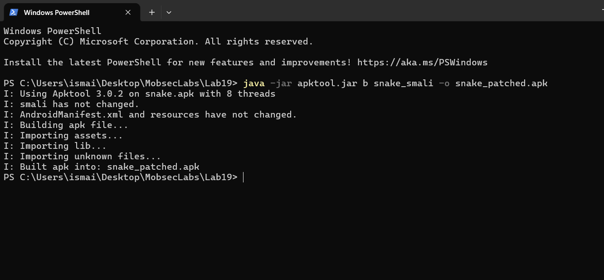
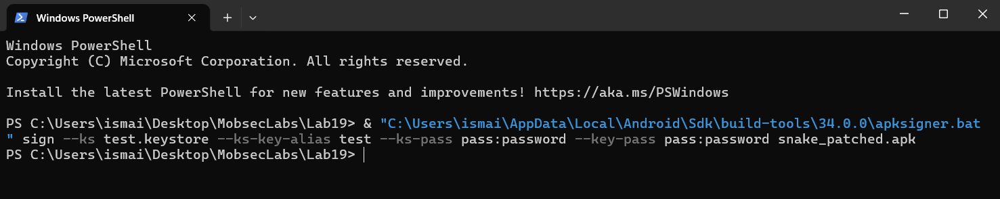
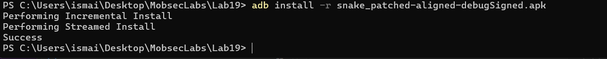
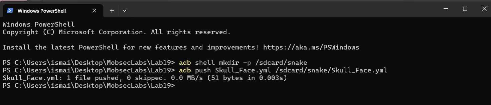
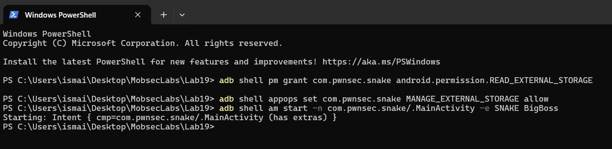
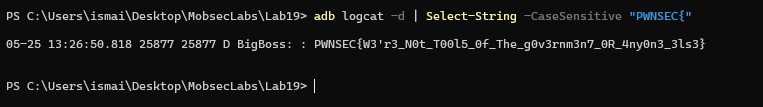

# Lab_19_MobileSecurity

Ce document décrit les étapes de résolution du challenge Snake de PwnSec.

## Étape 1 : Reconstruction de l'APK modifié
Après avoir modifié `MainActivity.smali` pour désactiver la détection du root et retarder le chargement de la bibliothèque JNI (afin de contourner la détection Frida au démarrage), l'application est reconstruite à l'aide d'Apktool.

```powershell
java -jar apktool.jar b snake_smali -o snake_patched.apk
```



## Étape 2 : Signature de l'APK
L'APK généré est signé à l'aide d'un keystore de test afin de permettre son installation sur l'émulateur.

```powershell
apksigner.bat sign --ks test.keystore --ks-key-alias test --ks-pass pass:password --key-pass pass:password snake_patched.apk
```



## Étape 3 : Installation de l'APK
L'application signée est installée sur l'émulateur Android.

```powershell
adb install -r snake_patched-aligned-debugSigned.apk
```



## Étape 4 : Copie de la charge utile (Payload)
Le répertoire de destination `/sdcard/snake` est créé, puis la charge utile SnakeYAML `Skull_Face.yml` y est copiée. Les permissions du fichier sur la partition brute `/data/media/0` sont ensuite configurées pour garantir l'accès en lecture à l'application.

```powershell
adb shell mkdir -p /sdcard/snake
adb push Skull_Face.yml /sdcard/snake/Skull_Face.yml
```



## Étape 5 : Autorisations et exécution
Les autorisations de stockage nécessaires (`READ_EXTERNAL_STORAGE` et l'AppOp `MANAGE_EXTERNAL_STORAGE`) sont accordées à l'application. L'activité principale est ensuite démarrée avec l'extra d'Intent requis pour déclencher la désérialisation.

```powershell
adb shell pm grant com.pwnsec.snake android.permission.READ_EXTERNAL_STORAGE
adb shell appops set com.pwnsec.snake MANAGE_EXTERNAL_STORAGE allow
adb shell am start -n com.pwnsec.snake/.MainActivity -e SNAKE BigBoss
```



## Étape 6 : Extraction du drapeau
La commande de filtrage logcat sensible à la casse permet d'extraire la ligne contenant le drapeau généré par la bibliothèque native après désérialisation réussie.

```powershell
adb logcat -d | Select-String -CaseSensitive "PWNSEC{"
```



Le drapeau extrait est : `PWNSEC{W3'r3_N0t_T00l5_0f_The_g0v3rnm3n7_0R_4ny0n3_3ls3}`
